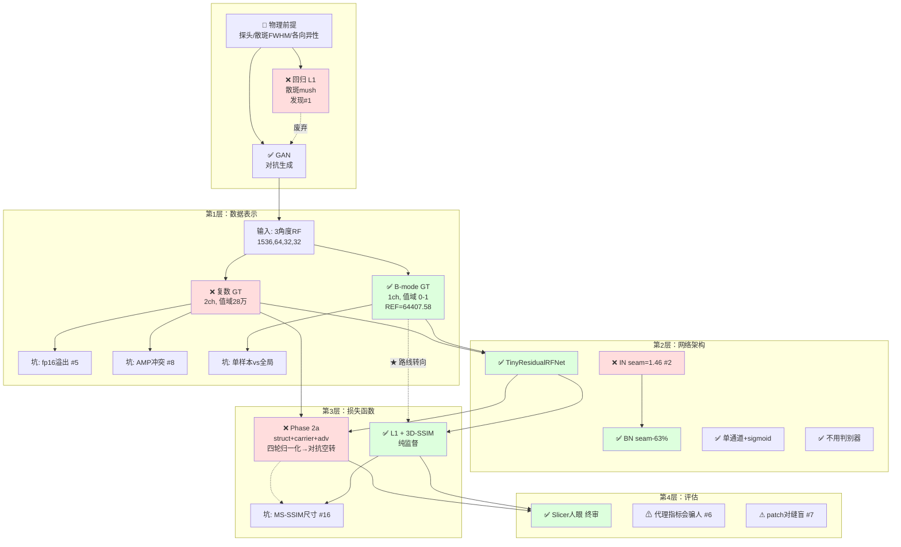
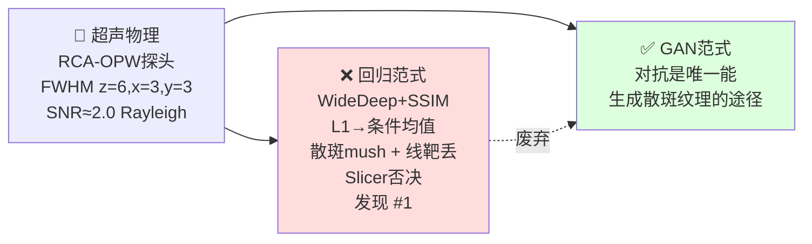
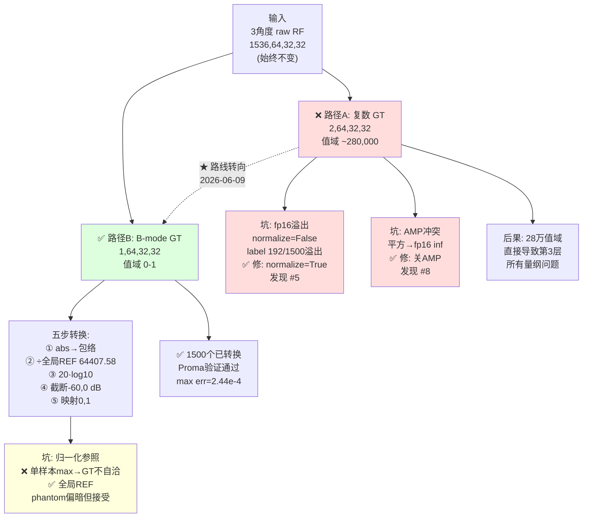
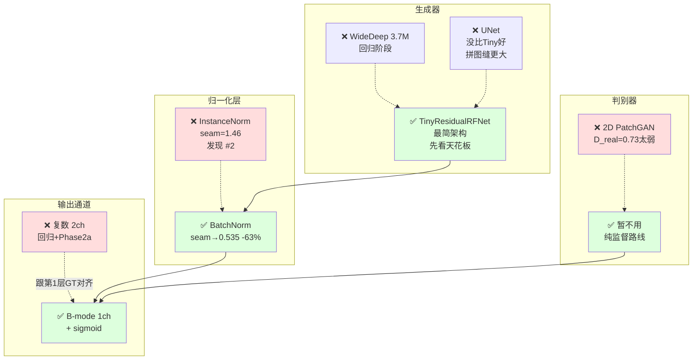
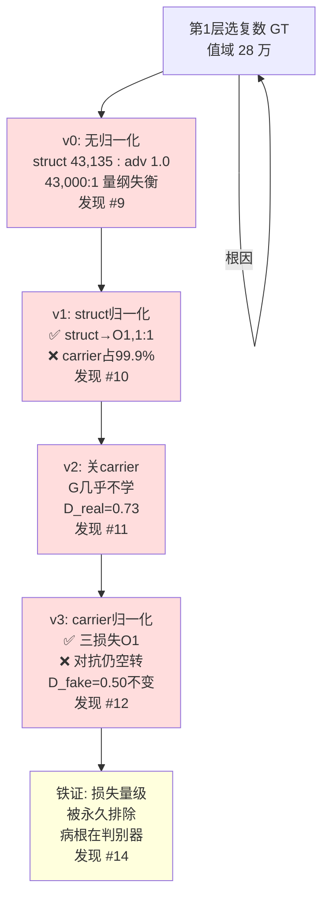
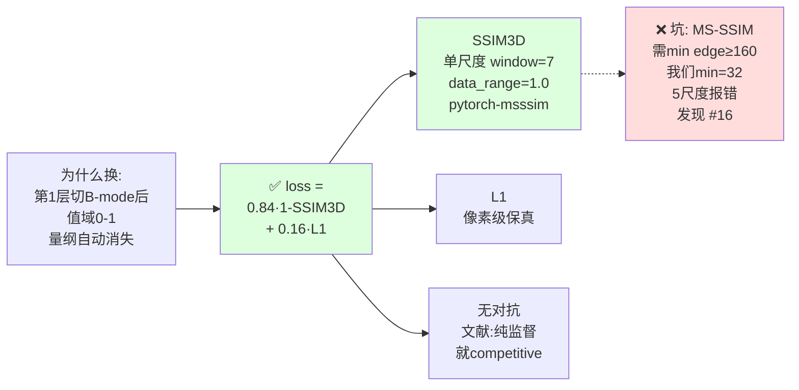
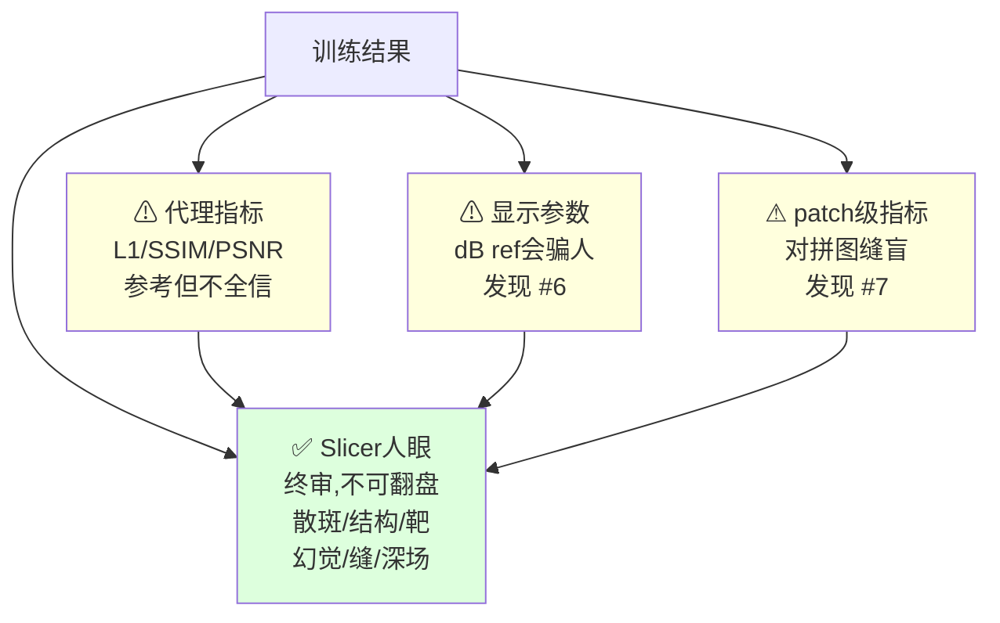
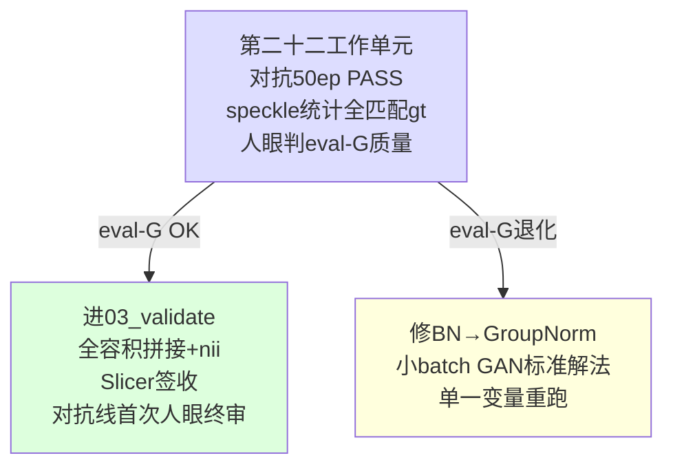

# 00 — 路线决策树

> 项目地图。纵向 = 四层塔，横向 = 每层的分叉 + 踩坑。
> 层间有依赖：下层选错，上层遭殃。下层选对，上层减负。
> 细节见 `04_当前状态`、`05_实验记录`、`06_关键发现`。
> **Mermaid 图在 VS Code / GitHub / Obsidian 中可直接渲染。**

---

## 全貌：四层塔

> 绿色 = 当前选中 | 红色 = 踩坑废弃 | ⚠ = 已知陷阱

---

## 地基：物理前提 + 范式选择

- RCA-OPW 轴向 0.0362mm / 横向 0.2mm，比例 1:5.5
- 下采样在 x/y 做、z 保守
- 低通 sigma_zyx=(6,3,3) 基于散斑 FWHM 设计
- 回归天花板是原理性的，不是调参能突破的

---

## 第1层：数据表示 — 什么形式进出

**当前状态**: GT = B-mode [1,64,32,32]，输入仍是 3 角度 RF，端到端不变。

---

## 第2层：网络架构 — 用什么结构学

**当前状态**: TinyResidualRFNet + BN + 单通道 sigmoid，无判别器。架构尚在起步，以后加复杂度。

---

## 第3层：损失函数 — 往哪个方向学（踩坑最密集）

### 复数空间阶段（Phase 2a，已废弃）

> `G = λ_adv·adv(LSGAN) + λ_struct·struct(低通包络L1) + λ_carrier·carrier(复数L1)`

**四轮消融烧了 ~25 GPU 小时，每轮只动一个变量。**
结论：量纲问题已全部解决，但对抗从未通电——判别器太弱（D_real=0.73）。

### B-mode 空间阶段（路线转向后，当前）

**当前状态**: 第十八工作单元训练中（50 epoch），等结果。

---

## 第4层：评估验证 — 怎么判断好坏

Codex 不可在人眼审查前宣称质量通过。

---

## 层间依赖（关键因果链）

---

## 当前分叉（待裁决）

> 纯 RF 路线五轮迭代：Tiny→灰雾 → U-Net纯监督→oversmooth
> → U-Net+对抗smoke→通电 → 正式50ep假红线→诊断BN失稳 → 修红线重跑→50ep PASS。
> Speckle统计全面匹配gt（mean/std/SNR）。对抗机制已验证成功。
> 当前：人等图 → 判eval-G视觉质量 → validate or 修BN。

---

## 踩坑清单（按塔层归类）

| 层 | 坑 | 发现 # |
|----|----|--------|
| 地基 | 回归 L1→散斑 mush | #1 |
| 第1层 | fp16 存储溢出（normalize 没开） | #5 |
| 第1层 | AMP 计算溢出（平方→fp16 inf） | #8 |
| 第1层 | 单样本 vs 全局归一化参照 | — |
| 第2层 | IN→拼图缝（BN 修复） | #2 |
| 第2层 | 线性归一化 vs log 压缩 for 复数 | #13 |
| 第3层 | struct 43,000:1 量纲失衡 | #9 |
| 第3层 | carrier 连锁主导 99.9% | #10 |
| 第3层 | carrier 消融: 必要 vs 拐杖之辩 | #11 |
| 第3层 | 对抗四轮空转，v3 铁证在判别器 | #12 |
| 第3层 | MS-SSIM 尺寸不兼容→单尺度 SSIM | #16 |
| 第3层 | 路线转向: 复数→B-mode（文献驱动） | #15 |
| 第3层 | 递进消融方法论 | #14 |
| 第4层 | 显示参数欺骗 | #6 |
| 第4层 | patch 指标对拼图缝盲 | #7 |
| 第3层 | 对抗终于通电——B-mode+3D D 是解药 | #18 |
| 方法论 | 权威锚定——论文不应替代独立判断 | #17 |

---

> **导航**: 到哪了 → `04_当前状态` | 怎么踩的 → `05_实验记录` | 提炼规律 → `06_关键发现`
